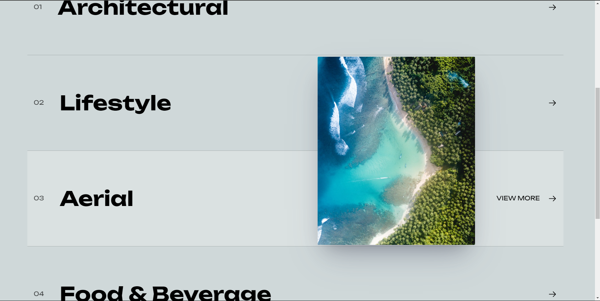

# React Interactive Media Overlay

This project is a React application that provides an interactive experience with media overlays. The app displays different profiles as images or a video based on the user's selection from a menu.



## Inspiration

This project was inspired by the work of the agency featured on Awwwards, specifically the [Wandergates](https://www.awwwards.com/sites/wandergates) site. I recreated a section in CSS to achieve a similar visual style and interactivity.

## Features

- **Interactive Menu**: Select different profiles from the menu.
- **Media Overlay**: Display images or a video in an overlay based on the selected profile.

## Installation

1. Clone the repository:

   ```bash
   git clone https://github.com/Bope142/react-interactive-menu-item.git

   ```

2. Install dependencies:

   ```bash
   npm install

   ```

3. Start the development server:

   ```bash
   npm run dev
   ```

## Author

Norbert Yemuang 🚀
